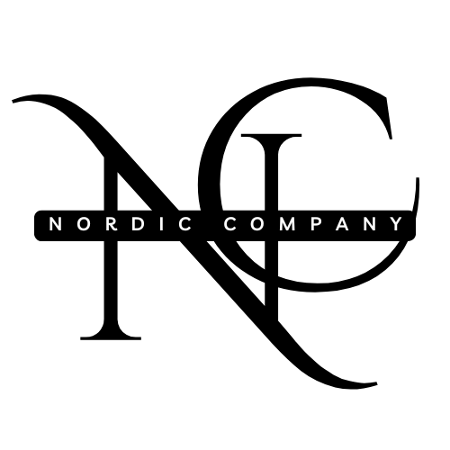

# Nordic Company 
 This project is a salon website, featuring a custom-built booking system. The booking system is built from scratch using React for the frontend and Django for the backend.

## Features
- Custom booking system built specifically for client needs.
- Integration between React and Django for a seamless user experience.
- A shop will be added in the future per client's request.

## Tech Stack
**Frontend**: React  
**Backend**: Django

## Databases
- **NEON Tech** - Database used in production.
- **SQLite3** - Database used during dvelopment

## Status
This project is currently under development.

  

